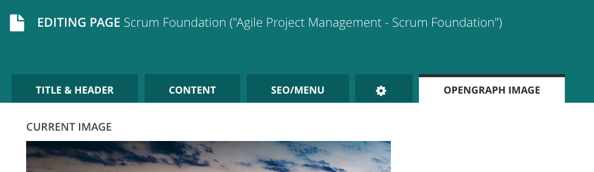

# wagtail-opengraph-image-generator

Wagtail Open Graph Image Generator will assist you in automatically creating [Open Graph](https://ogp.me/) images for your pages.

There are a handful of configuration options to popuplate images with your page's content.
Besides the title, there are options to provide a static company logo, subtitle, background image and page logo in the SVG format. While the resulting image will be a little bit opinionated, the defaults should work just fine in most cases.

The final image will be saved in the PNG format in a configurable Wagtail collection. It then can be used in your templates and code.

## Features

* Automatic creation of Open Graph protocol compatible images
* Live preview and configuration in a seperate tab in the Edit and Create views
* Several dynamic fields that can be configured to supply content for your generated image

## Requirements

* Python 3.6+
* Wagtail 2.7 LTS
* Django 2.2 LTS

_Earlier versions might work but have not been tested._

## Installation

Install with pip:
`pip install wagtail-opengraph-image-generator`

Add `wagtail_opengraph_image_generator` to your `INSTALLED_APPS`

Finally, apply the migrations with `python manage.py migrate`

## Usage

Once the addon is installed, you will notice a new tab in your edit/create view.



This new panel will allow you to preview your new Open Graph image before you save it.
Depending on your exact configuration this panel will provide slightly different options and customizations.

### Embedding in your template

Accessing the generated image is done with an image tag. Make sure to load it in your template and call `get_existing_og_image [page-object]` to save the image in a variable. You can then use it as any other Wagtail image.

```





    
    <meta property="og:image" content="{{ self.get_site.root_url }}{{ og_image.url }}">

```

## Documentation

For more information on getting started, an overview of all available settings and release notes, please see [our documentation on Read the Docs](docs/index.md).

## Support

Feel free to open issues and, even better, pull requests!

The development of this plugin is supported by [candylabs GmbH](https://go.candylabs.de/aqPw)

If you need commerical support developing a Wagtail site, Django application, MVP or digital platform, we'd love to hear from you at [info@candylabs.de](mailto:info@candylabs.de)!


